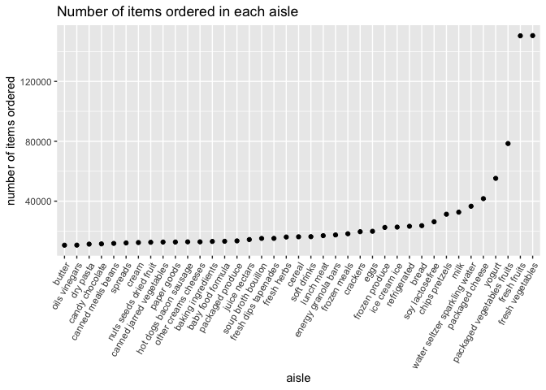

P8105 Homework 3
================
Christine Lucille Kuryla (clk2162)
2023-10-14

# Problem 1

Load data

``` r
library(p8105.datasets)
data("instacart")
```

Explore and describe dataset.

The goal is to do some exploration of this dataset. To that end, write a
short description of the dataset, noting the size and structure of the
data, describing some key variables, and giving illstrative examples of
observations.

``` r
# Check out the structure of the data set 
head(instacart)
```

    ## # A tibble: 6 × 15
    ##   order_id product_id add_to_cart_order reordered user_id eval_set order_number
    ##      <int>      <int>             <int>     <int>   <int> <chr>           <int>
    ## 1        1      49302                 1         1  112108 train               4
    ## 2        1      11109                 2         1  112108 train               4
    ## 3        1      10246                 3         0  112108 train               4
    ## 4        1      49683                 4         0  112108 train               4
    ## 5        1      43633                 5         1  112108 train               4
    ## 6        1      13176                 6         0  112108 train               4
    ## # ℹ 8 more variables: order_dow <int>, order_hour_of_day <int>,
    ## #   days_since_prior_order <int>, product_name <chr>, aisle_id <int>,
    ## #   department_id <int>, aisle <chr>, department <chr>

This dataset has 1384617 rows and 15 columns. The column names are
order_id, product_id, add_to_cart_order, reordered, user_id, eval_set,
order_number, order_dow, order_hour_of_day, days_since_prior_order,
product_name, aisle_id, department_id, aisle, department. It is in a
long format, and the order_id is not distinct. Each row in the datas et
represents a particular item purchased and contains corresponding
information about it. There are 131209 distinct orders, 131209 users (so
it seems to be one order per user), containing a total of 39123
products.

``` r
# aisles and number of times they occur (number of times there is an order from the aisle)
# arrange with most ordered from aisles at the top
aisles_df <- instacart %>%
  count(aisle) %>% 
  arrange(desc(n))

head(aisles_df)
```

    ## # A tibble: 6 × 2
    ##   aisle                              n
    ##   <chr>                          <int>
    ## 1 fresh vegetables              150609
    ## 2 fresh fruits                  150473
    ## 3 packaged vegetables fruits     78493
    ## 4 yogurt                         55240
    ## 5 packaged cheese                41699
    ## 6 water seltzer sparkling water  36617

There are 134 aisles. The aisles most ordered from are:

| aisle                         |
|:------------------------------|
| fresh vegetables              |
| fresh fruits                  |
| packaged vegetables fruits    |
| yogurt                        |
| packaged cheese               |
| water seltzer sparkling water |
| milk                          |
| chips pretzels                |
| soy lactosefree               |
| bread                         |

``` r
aisles_df %>%
  filter(n > 10000) %>% 
  mutate(aisle = fct_reorder(aisle, n)) %>% 
  ggplot(aes(x = aisle, y = n)) +
  geom_point() +
  labs(title = "Number of items ordered in each aisle",
       y = "number of items ordered") +
  theme(axis.text.x = element_text(angle = 60, hjust = 1))
```

<!-- -->

``` r
instacart %>% 
    filter(aisle %in% c("baking ingredients", "dog food care", "packaged vegetables fruits")) %>% 
      group_by(aisle) %>% 
    count(product_name) |> 
    mutate(rank = min_rank(desc(n))) %>% 
    filter(rank < 4) %>% 
    arrange(desc(n)) %>% 
    knitr::kable()
```

| aisle                      | product_name                                  |    n | rank |
|:---------------------------|:----------------------------------------------|-----:|-----:|
| packaged vegetables fruits | Organic Baby Spinach                          | 9784 |    1 |
| packaged vegetables fruits | Organic Raspberries                           | 5546 |    2 |
| packaged vegetables fruits | Organic Blueberries                           | 4966 |    3 |
| baking ingredients         | Light Brown Sugar                             |  499 |    1 |
| baking ingredients         | Pure Baking Soda                              |  387 |    2 |
| baking ingredients         | Cane Sugar                                    |  336 |    3 |
| dog food care              | Snack Sticks Chicken & Rice Recipe Dog Treats |   30 |    1 |
| dog food care              | Organix Chicken & Brown Rice Recipe           |   28 |    2 |
| dog food care              | Small Dog Biscuits                            |   26 |    3 |
