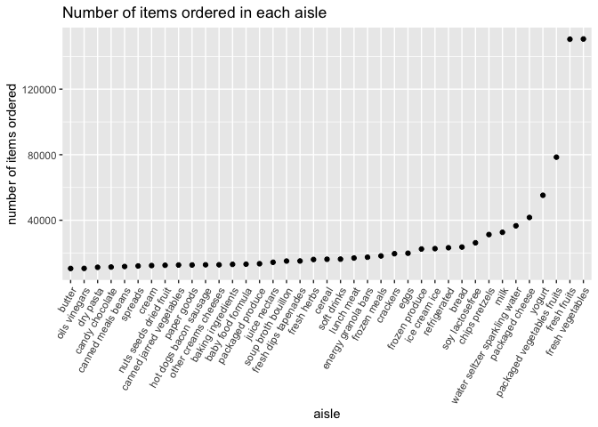
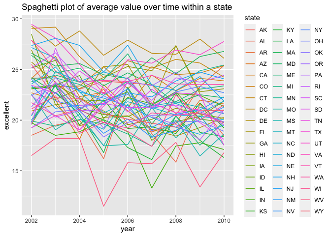
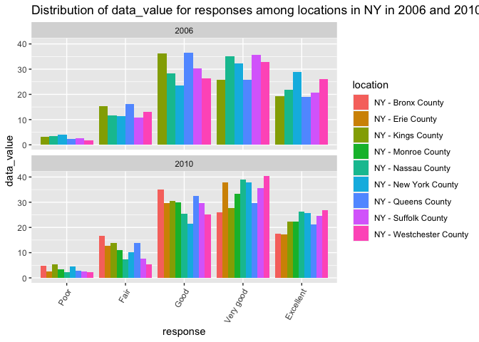
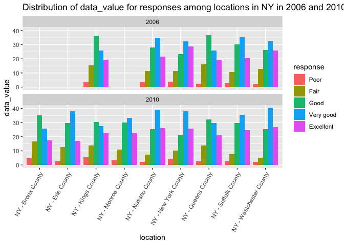
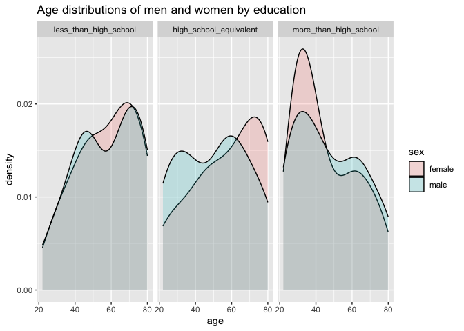
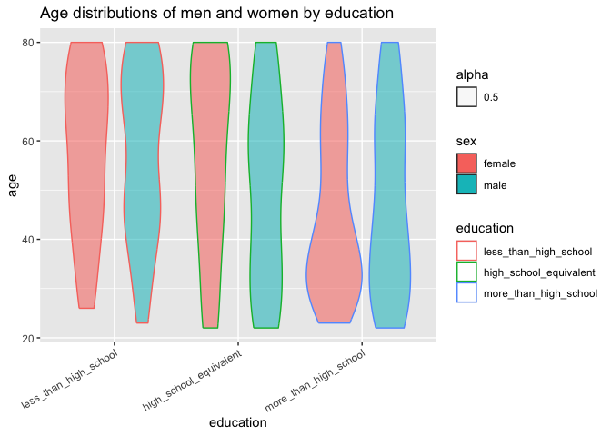
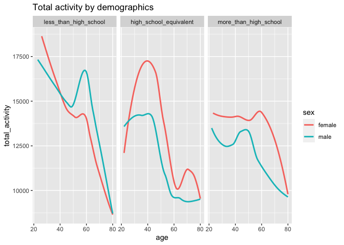
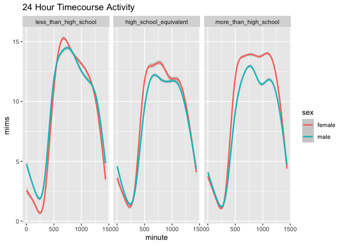

P8105 Homework 3
================
Christine Lucille Kuryla (clk2162)
2023-10-14

# Problem 1

Load data

``` r
library(p8105.datasets)
data("instacart")
```

Explore and describe dataset.

The goal is to do some exploration of this dataset. To that end, write a
short description of the dataset, noting the size and structure of the
data, describing some key variables, and giving illstrative examples of
observations.

``` r
# Check out the structure of the data set 
head(instacart)
```

    ## # A tibble: 6 × 15
    ##   order_id product_id add_to_cart_order reordered user_id eval_set order_number
    ##      <int>      <int>             <int>     <int>   <int> <chr>           <int>
    ## 1        1      49302                 1         1  112108 train               4
    ## 2        1      11109                 2         1  112108 train               4
    ## 3        1      10246                 3         0  112108 train               4
    ## 4        1      49683                 4         0  112108 train               4
    ## 5        1      43633                 5         1  112108 train               4
    ## 6        1      13176                 6         0  112108 train               4
    ## # ℹ 8 more variables: order_dow <int>, order_hour_of_day <int>,
    ## #   days_since_prior_order <int>, product_name <chr>, aisle_id <int>,
    ## #   department_id <int>, aisle <chr>, department <chr>

This dataset has 1384617 rows and 15 columns. The column names are
order_id, product_id, add_to_cart_order, reordered, user_id, eval_set,
order_number, order_dow, order_hour_of_day, days_since_prior_order,
product_name, aisle_id, department_id, aisle, department. It is in a
long format, and the order_id is not distinct. Each row in the datas et
represents a particular item purchased and contains corresponding
information about it. There are 131209 distinct orders, 131209 users (so
it seems to be one order per user), containing a total of 39123
products.

``` r
# aisles and number of times they occur (number of times there is an order from the aisle)
# arrange with most ordered from aisles at the top
aisles_df <- instacart %>%
  count(aisle) %>% 
  arrange(desc(n))

head(aisles_df)
```

    ## # A tibble: 6 × 2
    ##   aisle                              n
    ##   <chr>                          <int>
    ## 1 fresh vegetables              150609
    ## 2 fresh fruits                  150473
    ## 3 packaged vegetables fruits     78493
    ## 4 yogurt                         55240
    ## 5 packaged cheese                41699
    ## 6 water seltzer sparkling water  36617

There are 134 aisles. The aisles most ordered from are:

| aisle                         |
|:------------------------------|
| fresh vegetables              |
| fresh fruits                  |
| packaged vegetables fruits    |
| yogurt                        |
| packaged cheese               |
| water seltzer sparkling water |
| milk                          |
| chips pretzels                |
| soy lactosefree               |
| bread                         |

``` r
# Plot number of items ordered in top 10000 aisles
aisles_df %>%
  filter(n > 10000) %>% 
  mutate(aisle = fct_reorder(aisle, n)) %>% 
  ggplot(aes(x = aisle, y = n)) +
  geom_point() +
  labs(title = "Number of items ordered in each aisle",
       y = "number of items ordered") +
  theme(axis.text.x = element_text(angle = 60, hjust = 1))
```

<!-- -->

``` r
# Three most popular items in three aisles of interest
instacart %>% 
    filter(aisle %in% c("baking ingredients", "dog food care", "packaged vegetables fruits")) %>% 
      group_by(aisle) %>% 
    count(product_name) |> 
    mutate(rank = min_rank(desc(n))) %>% 
    filter(rank < 4) %>% 
    arrange(desc(n)) %>% 
    knitr::kable()
```

| aisle                      | product_name                                  |    n | rank |
|:---------------------------|:----------------------------------------------|-----:|-----:|
| packaged vegetables fruits | Organic Baby Spinach                          | 9784 |    1 |
| packaged vegetables fruits | Organic Raspberries                           | 5546 |    2 |
| packaged vegetables fruits | Organic Blueberries                           | 4966 |    3 |
| baking ingredients         | Light Brown Sugar                             |  499 |    1 |
| baking ingredients         | Pure Baking Soda                              |  387 |    2 |
| baking ingredients         | Cane Sugar                                    |  336 |    3 |
| dog food care              | Snack Sticks Chicken & Rice Recipe Dog Treats |   30 |    1 |
| dog food care              | Organix Chicken & Brown Rice Recipe           |   28 |    2 |
| dog food care              | Small Dog Biscuits                            |   26 |    3 |

``` r
# Pink Lady Apples and Coffee Ice Cream order details
instacart %>% 
  filter(product_name %in% c("Pink Lady Apples", "Coffee Ice Cream")) %>% 
  group_by(product_name, order_dow) %>% 
  summarize(mean_hour = mean(order_hour_of_day)) %>% 
  pivot_wider(
    names_from = order_dow, 
    values_from = mean_hour) %>% 
  knitr::kable(digits = 2)
```

    ## `summarise()` has grouped output by 'product_name'. You can override using the
    ## `.groups` argument.

| product_name     |     0 |     1 |     2 |     3 |     4 |     5 |     6 |
|:-----------------|------:|------:|------:|------:|------:|------:|------:|
| Coffee Ice Cream | 13.77 | 14.32 | 15.38 | 15.32 | 15.22 | 12.26 | 13.83 |
| Pink Lady Apples | 13.44 | 11.36 | 11.70 | 14.25 | 11.55 | 12.78 | 11.94 |

# Problem 2

This problem has to do with several things, we are focusing on self
reported health over locations and years.

Load data

``` r
library(p8105.datasets)
data("brfss_smart2010")
```

Clean data

``` r
brfss_smart2010_overall_health <- brfss_smart2010 %>%
  janitor::clean_names() %>%
  rename(state = locationabbr) %>% 
  filter(topic == "Overall Health") %>%
  mutate(response = fct_relevel(response, c("Poor", "Fair", "Good", "Very good", "Excellent")))

#brfss_smart2010_overall_health_excellent_poor <- brfss_smart2010_overall_health %>%
#  filter(response %in% c("Excellent", "Poor"))
  # include only responses from “Excellent” to “Poor” ???????

knitr::kable(head(brfss_smart2010_overall_health, n = 20))
```

| year | state | locationdesc           | class         | topic          | question                    | response  | sample_size | data_value | confidence_limit_low | confidence_limit_high | display_order | data_value_unit | data_value_type  | data_value_footnote_symbol | data_value_footnote | data_source | class_id | topic_id | location_id | question_id | respid  | geo_location            |
|-----:|:------|:-----------------------|:--------------|:---------------|:----------------------------|:----------|------------:|-----------:|---------------------:|----------------------:|--------------:|:----------------|:-----------------|:---------------------------|:--------------------|:------------|:---------|:---------|:------------|:------------|:--------|:------------------------|
| 2010 | AL    | AL - Jefferson County  | Health Status | Overall Health | How is your general health? | Excellent |          94 |       18.9 |                 14.1 |                  23.6 |             1 | %               | Crude Prevalence | NA                         | NA                  | BRFSS       | CLASS08  | Topic41  | NA          | GENHLTH     | RESP056 | (33.518601, -86.814688) |
| 2010 | AL    | AL - Jefferson County  | Health Status | Overall Health | How is your general health? | Very good |         148 |       30.0 |                 24.9 |                  35.0 |             2 | %               | Crude Prevalence | NA                         | NA                  | BRFSS       | CLASS08  | Topic41  | NA          | GENHLTH     | RESP057 | (33.518601, -86.814688) |
| 2010 | AL    | AL - Jefferson County  | Health Status | Overall Health | How is your general health? | Good      |         208 |       33.1 |                 28.2 |                  38.0 |             3 | %               | Crude Prevalence | NA                         | NA                  | BRFSS       | CLASS08  | Topic41  | NA          | GENHLTH     | RESP058 | (33.518601, -86.814688) |
| 2010 | AL    | AL - Jefferson County  | Health Status | Overall Health | How is your general health? | Fair      |         107 |       12.5 |                  9.5 |                  15.4 |             4 | %               | Crude Prevalence | NA                         | NA                  | BRFSS       | CLASS08  | Topic41  | NA          | GENHLTH     | RESP059 | (33.518601, -86.814688) |
| 2010 | AL    | AL - Jefferson County  | Health Status | Overall Health | How is your general health? | Poor      |          45 |        5.5 |                  3.5 |                   7.4 |             5 | %               | Crude Prevalence | NA                         | NA                  | BRFSS       | CLASS08  | Topic41  | NA          | GENHLTH     | RESP060 | (33.518601, -86.814688) |
| 2010 | AL    | AL - Mobile County     | Health Status | Overall Health | How is your general health? | Excellent |          91 |       15.6 |                 11.0 |                  20.1 |             1 | %               | Crude Prevalence | NA                         | NA                  | BRFSS       | CLASS08  | Topic41  | NA          | GENHLTH     | RESP056 | (30.683993, -88.170637) |
| 2010 | AL    | AL - Mobile County     | Health Status | Overall Health | How is your general health? | Very good |         177 |       31.3 |                 26.0 |                  36.5 |             2 | %               | Crude Prevalence | NA                         | NA                  | BRFSS       | CLASS08  | Topic41  | NA          | GENHLTH     | RESP057 | (30.683993, -88.170637) |
| 2010 | AL    | AL - Mobile County     | Health Status | Overall Health | How is your general health? | Good      |         224 |       31.2 |                 26.1 |                  36.2 |             3 | %               | Crude Prevalence | NA                         | NA                  | BRFSS       | CLASS08  | Topic41  | NA          | GENHLTH     | RESP058 | (30.683993, -88.170637) |
| 2010 | AL    | AL - Mobile County     | Health Status | Overall Health | How is your general health? | Fair      |         120 |       15.5 |                 11.7 |                  19.2 |             4 | %               | Crude Prevalence | NA                         | NA                  | BRFSS       | CLASS08  | Topic41  | NA          | GENHLTH     | RESP059 | (30.683993, -88.170637) |
| 2010 | AL    | AL - Mobile County     | Health Status | Overall Health | How is your general health? | Poor      |          66 |        6.4 |                  4.4 |                   8.3 |             5 | %               | Crude Prevalence | NA                         | NA                  | BRFSS       | CLASS08  | Topic41  | NA          | GENHLTH     | RESP060 | (30.683993, -88.170637) |
| 2010 | AL    | AL - Tuscaloosa County | Health Status | Overall Health | How is your general health? | Excellent |          58 |       20.8 |                 14.1 |                  27.4 |             1 | %               | Crude Prevalence | NA                         | NA                  | BRFSS       | CLASS08  | Topic41  | NA          | GENHLTH     | RESP056 | (33.214154, -87.520229) |
| 2010 | AL    | AL - Tuscaloosa County | Health Status | Overall Health | How is your general health? | Very good |         109 |       29.5 |                 23.2 |                  35.7 |             2 | %               | Crude Prevalence | NA                         | NA                  | BRFSS       | CLASS08  | Topic41  | NA          | GENHLTH     | RESP057 | (33.214154, -87.520229) |
| 2010 | AL    | AL - Tuscaloosa County | Health Status | Overall Health | How is your general health? | Good      |         171 |       33.8 |                 27.7 |                  39.8 |             3 | %               | Crude Prevalence | NA                         | NA                  | BRFSS       | CLASS08  | Topic41  | NA          | GENHLTH     | RESP058 | (33.214154, -87.520229) |
| 2010 | AL    | AL - Tuscaloosa County | Health Status | Overall Health | How is your general health? | Fair      |          62 |       11.7 |                  7.3 |                  16.0 |             4 | %               | Crude Prevalence | NA                         | NA                  | BRFSS       | CLASS08  | Topic41  | NA          | GENHLTH     | RESP059 | (33.214154, -87.520229) |
| 2010 | AL    | AL - Tuscaloosa County | Health Status | Overall Health | How is your general health? | Poor      |          35 |        4.2 |                  2.6 |                   5.7 |             5 | %               | Crude Prevalence | NA                         | NA                  | BRFSS       | CLASS08  | Topic41  | NA          | GENHLTH     | RESP060 | (33.214154, -87.520229) |
| 2010 | AZ    | AZ - Maricopa County   | Health Status | Overall Health | How is your general health? | Excellent |         269 |       27.3 |                 23.3 |                  31.2 |             1 | %               | Crude Prevalence | NA                         | NA                  | BRFSS       | CLASS08  | Topic41  | NA          | GENHLTH     | RESP056 | (33.493403, -112.04143) |
| 2010 | AZ    | AZ - Maricopa County   | Health Status | Overall Health | How is your general health? | Very good |         399 |       31.9 |                 27.9 |                  35.8 |             2 | %               | Crude Prevalence | NA                         | NA                  | BRFSS       | CLASS08  | Topic41  | NA          | GENHLTH     | RESP057 | (33.493403, -112.04143) |
| 2010 | AZ    | AZ - Maricopa County   | Health Status | Overall Health | How is your general health? | Good      |         384 |       27.7 |                 24.1 |                  31.2 |             3 | %               | Crude Prevalence | NA                         | NA                  | BRFSS       | CLASS08  | Topic41  | NA          | GENHLTH     | RESP058 | (33.493403, -112.04143) |
| 2010 | AZ    | AZ - Maricopa County   | Health Status | Overall Health | How is your general health? | Fair      |         156 |        9.6 |                  7.4 |                  11.7 |             4 | %               | Crude Prevalence | NA                         | NA                  | BRFSS       | CLASS08  | Topic41  | NA          | GENHLTH     | RESP059 | (33.493403, -112.04143) |
| 2010 | AZ    | AZ - Maricopa County   | Health Status | Overall Health | How is your general health? | Poor      |          62 |        3.5 |                  2.3 |                   4.6 |             5 | %               | Crude Prevalence | NA                         | NA                  | BRFSS       | CLASS08  | Topic41  | NA          | GENHLTH     | RESP060 | (33.493403, -112.04143) |

``` r
#knitr::kable(head(brfss_smart2010_overall_health_excellent_poor, n = 20))
```

In 2002, which states were observed at 7 or more locations? What about
in 2010?

In 2002, the states observed at 7 or more locations were:

``` r
# Filter for 2002, determine number of locations per state, keep only those with seven or more

brfss_smart2010_overall_health %>% 
  filter(year == 2002) %>% 
  filter(response == "Excellent") %>% # Arbitarily filter by one response so there is only one observation per location
  count(state) %>%
  filter(n >= 7) %>%
  select(state) %>% 
  knitr::kable(caption = "States with seven or more locations in 2002")
```

| state |
|:------|
| CT    |
| FL    |
| MA    |
| NC    |
| NJ    |
| PA    |

States with seven or more locations in 2002

In 2010, the states observed at 7 or more locations were:

``` r
# Filter for 2010, determine number of locations per state, keep only those with seven or more

brfss_smart2010_overall_health %>% 
  filter(year == 2010) %>% 
  filter(response == "Excellent") %>% # Arbitarily filter by one response so there is only one observation per location
  count(state) %>%
  filter(n >= 7) %>% 
  select(state) %>% 
  knitr::kable(caption = "States with seven or more locations in 2010")
```

| state |
|:------|
| CA    |
| CO    |
| FL    |
| MA    |
| MD    |
| NC    |
| NE    |
| NJ    |
| NY    |
| OH    |
| PA    |
| SC    |
| TX    |
| WA    |

States with seven or more locations in 2010

``` r
# Construct a dataset that is limited to Excellent responses, and contains, year, state, and a variable that averages the data_value across locations within a state.

brfss_excellent <- brfss_smart2010_overall_health %>% 
  filter(response == "Excellent") %>%
  group_by(state, year) %>% 
  summarise(excellent = mean(data_value)) 
```

    ## `summarise()` has grouped output by 'state'. You can override using the
    ## `.groups` argument.

``` r
knitr::kable(head(brfss_excellent, n=20))
```

| state | year | excellent |
|:------|-----:|----------:|
| AK    | 2002 |  27.90000 |
| AK    | 2003 |  24.85000 |
| AK    | 2004 |  23.05000 |
| AK    | 2005 |  23.85000 |
| AK    | 2007 |  23.50000 |
| AK    | 2008 |  20.60000 |
| AK    | 2009 |  23.20000 |
| AL    | 2002 |  18.50000 |
| AL    | 2003 |  19.50000 |
| AL    | 2004 |  20.00000 |
| AL    | 2005 |  16.20000 |
| AL    | 2006 |  23.20000 |
| AL    | 2007 |  18.65000 |
| AL    | 2008 |  15.85000 |
| AL    | 2009 |  21.60000 |
| AL    | 2010 |  18.43333 |
| AR    | 2002 |  24.10000 |
| AR    | 2003 |  24.30000 |
| AR    | 2004 |  21.00000 |
| AR    | 2005 |  23.06667 |

``` r
#  Make a “spaghetti” plot of this average value over time within a state (that is, make a plot showing a line for each state across years).

brfss_excellent %>% 
  ggplot(aes(x = year, y = excellent, color = state)) +
  geom_line() +
  labs(title = "Spaghetti plot of average value over time within a state")
```

    ## Warning: Removed 3 rows containing missing values (`geom_line()`).

<!-- -->

This plot shows relatively stable proportions of participants with
“Excellent” as their response, ranging from around 15-30%.

``` r
# Make a two-panel plot showing, for the years 2006, and 2010, distribution of data_value for responses (“Poor” to “Excellent”) among locations in NY State.

brfss_smart2010_overall_health %>%
  filter(year %in% c(2006,2010)) %>%
  filter(state == "NY") %>%
 # filter(response %in% c("Poor", "Excellent")) %>%
  mutate(location = as.factor(locationdesc)) %>%
#  ggplot(aes(x = location, y = data_value, fill = response)) +
  ggplot(aes(x = response, y = data_value, fill = location)) +
  geom_bar(stat = "identity", position = "dodge") +
  facet_wrap(~year, ncol = 1) +
  theme(axis.text.x = element_text(angle = 60, hjust = 1)) +
  labs(title = "Distribution of data_value for responses among locations in NY in 2006 and 2010")
```

<!-- -->

``` r
# Or, viewed another way, 

brfss_smart2010_overall_health %>%
  filter(year %in% c(2006,2010)) %>%
  filter(state == "NY") %>%
 # filter(response %in% c("Poor", "Excellent")) %>%
  mutate(location = as.factor(locationdesc)) %>%
  ggplot(aes(x = location, y = data_value, fill = response)) +
#  ggplot(aes(x = response, y = data_value, fill = location)) +
  geom_bar(stat = "identity", position = "dodge") +
  facet_wrap(~year, ncol = 1) +
  theme(axis.text.x = element_text(angle = 60, hjust = 1)) +
  labs(title = "Distribution of data_value for responses among locations in NY in 2006 and 2010")
```

<!-- -->

From these visualizations, we can see that the most common responses are
generally “Good” and “Very good.” Usually, “Very good” is more common
than “Good,” except for some years and locations, such as Kings and
Queens Counties in 2006 and Bronx County in 2010 (there is no data for
the Bronx in 2006). In 2010, more counties were surveyed than in 2006.

## Problem 3

This problem has to do with accelerometers in observational studies and
clinical trials.

Load, clean, and tidy data.

``` r
nhanes_accel <- read_csv("./data/nhanes_accel.csv")
```

    ## Rows: 250 Columns: 1441
    ## ── Column specification ────────────────────────────────────────────────────────
    ## Delimiter: ","
    ## dbl (1441): SEQN, min1, min2, min3, min4, min5, min6, min7, min8, min9, min1...
    ## 
    ## ℹ Use `spec()` to retrieve the full column specification for this data.
    ## ℹ Specify the column types or set `show_col_types = FALSE` to quiet this message.

``` r
nhanes_covar <- read_csv("./data/nhanes_covar.csv", skip = 4)
```

    ## Rows: 250 Columns: 5
    ## ── Column specification ────────────────────────────────────────────────────────
    ## Delimiter: ","
    ## dbl (5): SEQN, sex, age, BMI, education
    ## 
    ## ℹ Use `spec()` to retrieve the full column specification for this data.
    ## ℹ Specify the column types or set `show_col_types = FALSE` to quiet this message.

``` r
nhanes_accel <- nhanes_accel %>% 
  janitor::clean_names() %>% 
  mutate(seqn = as.character(seqn)) 
  
nhanes_covar <- nhanes_covar %>% 
  janitor::clean_names() %>% 
  filter(age > 21) %>% 
  filter(!is.na(age) & !is.na(sex) & !is.na(bmi) & !is.na(education)) %>%
  mutate(sex = as.character(sex)) %>% 
  mutate(education = as.character(education)) %>% 
  mutate(sex = case_match(sex,
                          "1" ~ "male",
                          "2" ~ "female")) %>% 
  mutate(education = case_match(education,
                                "1" ~ "less_than_high_school",
                                "2" ~ "high_school_equivalent",
                                "3" ~ "more_than_high_school")) %>%
  mutate(education = fct_relevel(education, c("less_than_high_school", "high_school_equivalent", "more_than_high_school"))) %>% 
  mutate(seqn = as.character(seqn)) %>% 
  mutate(sex = as.factor(sex))
  

# combine the two dfs

nhanes_df <- inner_join(nhanes_covar, nhanes_accel, by = "seqn")
```

Now we will explore the education distribution over demographic
variables.

``` r
# Table showing the number of men and women in each education category

education_sex <- nhanes_covar %>% 
  select(sex, education) %>% 
  group_by(education, sex) %>%
  count(education, sex) %>% 
  pivot_wider(names_from = sex,
              values_from = n)

knitr::kable(education_sex)
```

| education              | female | male |
|:-----------------------|-------:|-----:|
| less_than_high_school  |     28 |   27 |
| high_school_equivalent |     23 |   34 |
| more_than_high_school  |     59 |   54 |

From the table, we see that the most common education level is more than
high school. The distributions are relatively similar between sexes,
except that there are substantially more males than females in the high
school equivalent category.

``` r
# visualization of the age distributions for men and women in each education category

library(ggridges)

nhanes_covar %>%
 # ggplot(aes(x = education, y = age, fill = sex)) +
 # geom_violin(aes(color = education, alpha = 0.5))
#  theme(axis.text.x = element_text(angle = 30, hjust = 1)) +
  ggplot(aes(x = age, fill = sex)) +
  geom_density(alpha = 0.2) +
  labs(title = "Age distributions of men and women by education") +
  facet_grid(~education)
```

<!-- -->

``` r
nhanes_covar %>%
  ggplot(aes(x = education, y = age, fill = sex)) +
  geom_violin(aes(color = education, alpha = 0.5)) +
  theme(axis.text.x = element_text(angle = 30, hjust = 1)) +
  labs(title = "Age distributions of men and women by education") 
```

<!-- -->

``` r
#  facet_grid(~sex)
```

From these plots, we can see that there are more women below 40 who are
in the more than high school category than men, and that in that
category, the ages skew younger. In the less than high school category,
the ages skew older, and are relatively similar across gender. For the
high school equivalent category, there males are generally younger than
the females.

Now, look at total activity for participants.

``` r
# Using your tidied dataset, aggregate across minutes to create a total activity variable for each participant. Plot these total activities (y-axis) against age (x-axis); your plot should compare men to women and have separate panels for each education level. Include a trend line or a smooth to illustrate differences. Comment on your plot.

mims_df <- nhanes_df %>%
  pivot_longer("min1":"min1440",
               names_to = "minute",
               values_to = "mims") %>%
  group_by(seqn) %>% 
  summarise(total_activity = sum(mims))

mims_and_demographics <- inner_join(mims_df, nhanes_covar, by = "seqn")
  
# plot the data

mims_and_demographics %>% 
  ggplot(aes(x = age, y = total_activity, color = sex)) +
  geom_smooth(se = FALSE) +
  labs(title = "Total activity by demographics") +
  facet_grid(~ education)
```

    ## `geom_smooth()` using method = 'loess' and formula = 'y ~ x'

<!-- -->

From this plot we can see that in high school equivalent and more than
high school, the females tend to have more activity, while in the less
than high school it is similar. In the less than highschool, activity
decreases sharply after 60 for both sexes.

Now let’s explore the data by timecourse.

``` r
timecourse_df <- nhanes_df %>% 
  pivot_longer("min1":"min1440",
               names_to = "minute",
               values_to = "mims") %>% 
  mutate(minute = substr(minute, 4, nchar(minute))) %>%
  mutate(minute = as.numeric(minute))

timecourse_df %>% 
  group_by(seqn) %>% 
  ggplot(aes(x = minute, y = mims, color = sex)) +
  geom_smooth() +
  facet_grid(~education) +
  labs(title = "24 Hour Timecourse Activity")
```

    ## `geom_smooth()` using method = 'gam' and formula = 'y ~ s(x, bs = "cs")'

<!-- -->

We can see that for all education levels, the general trend is similar,
with activity low during times when people would be asleep, and high
during the day. It is similar for both sexes, although in more than high
school groups, the women are slightly more active.
